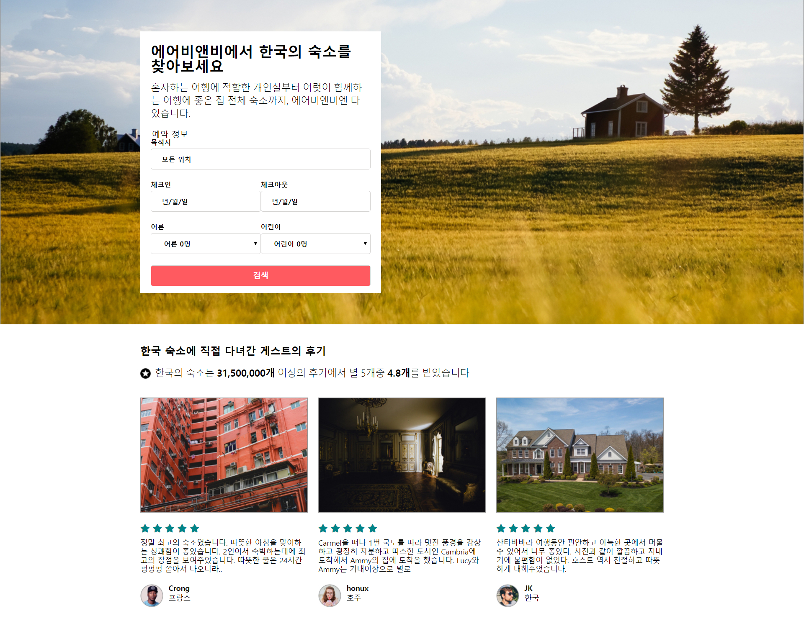

## 이번주 배운 것

- 브라우저의 동작방식
- HTML안에 js,css의 위치는 어디에 위치했는가? 왜 그랬을까?
- 화면을 표시하기 위해 어떤 파일들이 다운로드 되는가?
- 특정 자원의 Request Headers 와 Response Headers의 내용을 분석.
- 화면에 보여지기 시작하는 시간은 언제인가?
- DOMContentLoaded라는 이벤트는 언제 발생하는가? load랑은 어떤 차이점이 있는가?
- HTML
- CSS

## [미션] airbnb - html / css

- HTML 작업을 한다.
- CSS 작업을 한다.
- 디자인에 맞춰서 정확히 동일하게 개발한다.
- px정보를 정확히 맞춰서 작업한다.

## 코드리뷰

1. 잘된 점

   - 미디어쿼리 시도한 점
   - 클래스 네이밍이 좀더 일관되고 정리된 코드

2. 개선할 사항
   - 자손이면 공백으로 하고, 자식이면 > 를 활용해 보기
   - 문장내에서 강조의 의미라면 strong을 사용하고,
     굵은스타일을 보여주는 것이면 css로 작업

## 느낀점

div의 사용 방법이 생각보다 어려웠다 (ul이나 li태그를 div로 또한번 감싸야 하는지 등등..) 이부분은 css에 대한 경험이 많이 없어서 그런 것 같다. 접근성을 고려한 html 구조 짜는 방법을 좀 더 공부하고 css를 최대한 많이 접해보며 익숙해져야 할 것 같다.

## 이미지

