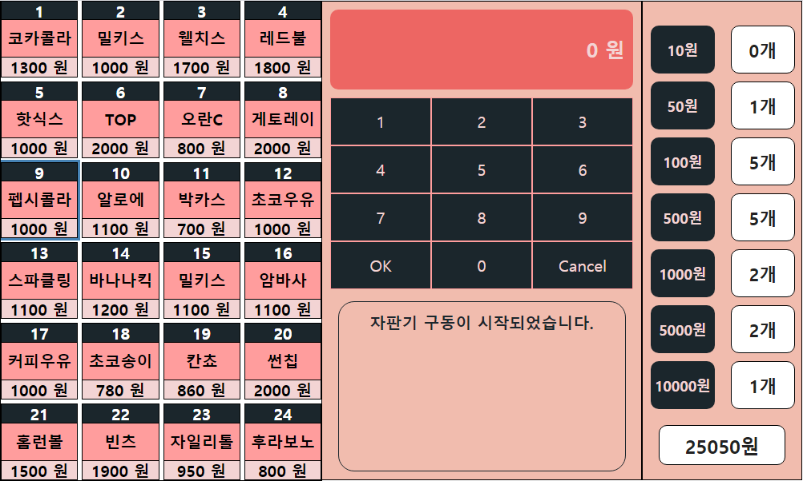

## 이번주 배운 것
- 비동기제어와-모듈라프로그래밍
- Observer패턴
- Express : getting started 항목
- 개발프로세스와 이슈관리
- 노드웹서버

## [미션] 웹자판기 요구사항 - 페어로 진행
- HTML,CSS,JS 는 멤버가 골고루 개발해야 한다(HTML,CSS 전담 )
- 단위 기능이 완료되면 PR을 보내고 서로의 코드를 확인하고 머지한다.
- github issue에 개발해야 할 리스트를 적는다.
- github branch 를 어떻게 만들지 고민하고 규칙을 정한다 (master , dev , feature브랜치 등)
- 금요일 오후 4시에는 오프라인 데모행사를 연다.

## 프로그래밍 요구사항
- ES Modules 를 사용해서 modular 프로그래밍을 구현한다. (import, export 방식)
- 비동기 작업은 promise의 then메서드 대신 async, await 를 사용한다.
- Model과 View 역할을 분리해서 각각 객체로 만들고, Observer 패턴을 사용해서 M,V를 연결한다.
- Model의 갯수나, View의 갯수는 각각 2개이상 만든다.
- Express 모듈을 설치하고 API요청을 router를 통해서 처리하도록 해본다.

## 코드리뷰

- 잘된 점
  - 객체를 비교할 때 아래와 같이하면 쉽게 비교가 가능하다.
```js
JSON.stringify(this._walletCashArray) === JSON.stringify(walletCashArray);
```
  

- 아쉬운 점
  - 자칫 constructor 가 너무 커지지 않도록. 생성자는 '속성초기화' 용도가 가장 중요한 역할이다.
  - DB없이 서버에서 상태관리하는 과정이 어색해보인다.


## 느낀점
이번 페어는 경험이 많은 zello와 하게 되어 자연스럽게 zello가 구조를 잡고 나는 그에 맞는 메서드를 구현하는 방식으로 진행했다. 모든 구조를 잡아줘서 쉽게 구현할 수 있었지만 다른 사람의 코드 의도를 파악해서 그에 맞춰 구현하려니 쉽지만은 않았다. 다른 사람의 코드를 이해하는 것이 가장 큰 어려움이었다. 이번 미션을 통해서 배운 것이 참 많은 것 같아서 페어는 어렵지만 배울 것 이 많다는 것을 깨달았다. 아쉬운 점은 좀 더 적극적으로 미션에 참여했으면 좋았을 것 같다는 생각이 들었다. 이번에 배운 경험을 바탕으로 시간 날 때 조금씩 스스로 구현해 봐야겠다.

## issue관리
https://github.com/codesquad-memeber-2020/vm-3/issues/1

이슈관리는 처음 해봤는데 기능별로 나누고 브랜치를 그에 맞게 생성해서 기능들을 관리하니까 불편한 점도 많았지만 내가 무엇을 구현해야 하는지 명확하게 알 수 있어서 그 부분은 좋았다. 처음에는 이슈 작성이 어색하고 어떤 단위로 기능을 나누고 작성해야 하는지가 어려웠다.

## 이미지

